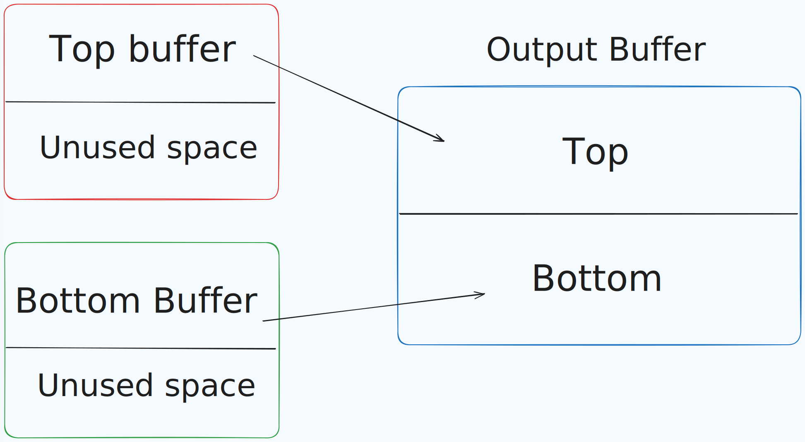

# TT-GoL

Conway's Game of Life implemented into Tenstorrent

## How it works
Since the entire grid needs to known for Game of Life to function, two circular buffers are used to act as the "top" and "bottom" parts of the grid. This is because of the way TT processes things in a tile-based environment and at scenario like a 64x64 grid, you can only process half of it at a time. This is quite tricky when implementing Game of Life into TT when we need information of our neighbouring cells.



\* If you can figure out how to simplify this and can scale in larger resolutions, please send a PR

Each tile is a 1D uint32_t array fundamentally where in this case 1 represents an alive cell and 0 represents a dead cell. To convert into a 2D coordinate from a 1D array I used this function:

```c++
inline int to_idx(int x, int y, int tile_width, int tile_height) {
    x = ((x % tile_width) + tile_width) % tile_width;
    y = ((y % tile_height) + tile_height) % tile_height;
    return y * tile_width + x;
}
```

This wraps the boundaries of the grid connecting the cells that are at the edges of the grid to the opposite edge.

When we do the step function in this implementation, we're actually only processing one half of a grid which is why we need two tiles to represent a full state. 

## Dataflow
In this implementation, we use `cb_id_in0` as the top tile, `cb_id_in1` as the bottom tile, and `cb_id_in2` as the output tile. The host enqueues their respective data which is read in the Reader Kernel and then assigned their respective circular buffer. After that, they are sent to the writer kernel which all buffer modification and essentially a single step is processed. After a step is finished, `cb_id_in2`'s circular buffer is written to `cb_id_dst0` as its destination circular buffer to be read back in the host when the kernel ends.

## Compiling and running
### Requirements

1. You need a Tenstorrent card which [you can buy](https://tenstorrent.com/) in their website.

2. You need to build `TT-Metal` which you can follow through [here](https://github.com/tenstorrent/tt-metal/blob/main/INSTALLING.md)

*THIS PROJECT WAS BUILT IN TT-METAL COMMIT `91e61c006a9c1900ec90aee8e0898f69574bae04`, will update soon so it works with the latest commits.

3. Set environment variables before building TT-GoL
```sh
export TT_METAL_HOME=/path/to/tt-metal
export ARCH_NAME=grayskull # EXAMPLE
```

4. Install SDL2
```sh
sudo apt libsdl2-dev libsdl2-2.0-0
```

5. Clone this repository
```sh
git clone https://github.com/JushBJJ/TT-GoL
cd TT-GoL
```

6. Run cmake
```sh
cmake -S . -B build -DCMAKE_CXX_COMPILER=clang++-17 -DCMAKE_C_COMPILER=clang-17
# This has only been tested on clang++-17 it may not work with g++
```

7. Run make
```sh
make -C build
```

8. Run the program
```sh
# note: You MUST do it in the parent directory or else TT-Metal wont recognise the kernels
./build/TT-GoL
```

You can stop the program by pressing Q on the SDL2 window.

You can also modify `main.cpp` to modify the number of frames you want to see and how many ms delay you want for each step.